# Drift Sense

Navigation error recovery for wafer inspection tools. Given a high magnification reference image of a die site and a wider, noisier search image of the surrounding region, find where the reference pattern sits inside the search image and return its centre coordinates.

The repository contains two deliverables plus the evidence behind them: a synthetic dataset generator grounded in published semiconductor structure and SEM imaging physics, and a localization algorithm with a documented failure analysis. It carries both phases of the Applied Materials problem statement. Phase 1 localizes a reference known to be present at a known ten to one magnification; Phase 2 removes those assumptions, so the magnification is unknown across an eight to twelve range, the rotation is unknown and must be reported, and about one pair in five contains no true instance at all, which the system must recognise and refuse rather than answer.

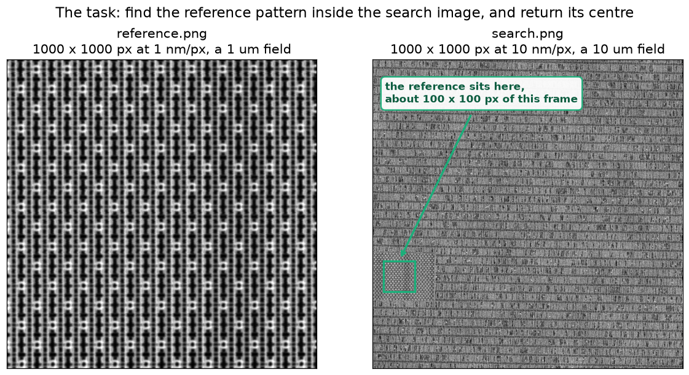

Both images are generated by this repository, and the true centre is recorded with them. The reference occupies roughly 100 x 100 px of the search frame, and the surrounding layout repeats, so hundreds of sites look alike. That ambiguity, rather than noise, is what makes the task hard.

## Problem and conventions

| Item | Value |
| --- | --- |
| Reference image | 1000 x 1000 grayscale, 1 nm per pixel, 1 um field of view |
| Search image | 1000 x 1000 grayscale, 8 to 12 nm per pixel, an 8 to 12 um field of view |
| Scale relationship | unknown, searched over the disclosed 8 to 1 through 12 to 1 range |
| Rotation | unknown, searched over plus or minus 5 degrees and reported, polished to a median 0.12 degrees |
| Reference presence | not guaranteed; a pair with no true instance is refused rather than answered |
| Output | centre x y sub pixel, rotation, recovered scale, found flag, confidence |
| Coordinate origin | centre of the top left pixel, x increases right, y increases down |
| Multiple matches | the match closest to the search image centre is returned |
| Runtime | median 4.02 s per pair measured through the entry point on a proportional holdout under the reference machine stack, Python 3.11 with numpy 2.4.6 and scipy 1.17.1; worst pair observed 9.01 s against a 20 s forfeit, and the run to run band of suite medians on one machine is about a second |

### What changed in Phase 2

Three Phase 1 assumptions are removed, and the required output grows from two columns to six. The disclosed ranges are exact and the addendum states that hard coding them is intended.

| | Phase 1 as issued | Phase 2 |
| --- | --- | --- |
| Zoom ratio | exactly 10x, given | **unknown, uniform in 8x to 12x** |
| Rotation | injected as noise, 1 to 3 degrees | **unknown, plus minus 5 degrees, and must be reported** |
| Is the reference present? | always present | **about 20 percent of pairs contain no true instance** (40 of the 200 blind pairs, which is 22 percent of the 180 grayscale pairs the rejection F1 is scored over) |
| Required output | x, y | **x, y, theta, scale, found, score** |
| Entry point | `localize.py` | **`register.py --input pairs.csv --output predictions.csv`** |

| Output column | Meaning |
| --- | --- |
| `pair_id` | as supplied in pairs.csv, every id exactly once, a missing row scores zero |
| `x, y` | match centre in wide search coordinates, float, sub pixel allowed |
| `theta` | rotation in degrees, counter clockwise positive, about the match centre |
| `scale` | recovered down scaling factor, nominally in 8 to 12 |
| `found` | 1 or 0; when 0 the pose columns carry 0 |
| `score` | own confidence, any monotonic scale, checked for calibration not compared between teams. Ours is the larger of the presence model's probability and its complement, damped for a found row by how many of the four template quadrants agreed on the site, so it is confidence in **the decision actually made**: a confident rejection ranks as high as a confident detection. It rises and falls with being right rather than with the correlation peak. Range is nominally 0.5 to 1.0 and no fixed range is claimed; see How the score column is computed below |

The reference pattern occupies roughly 100 x 100 pixels inside the search image. The two images are independent physical captures, so their noise is independent and the search image is the noisier of the two.

### End to end pipeline

The three Phase 2 changes are marked: the zoom ratio and rotation are unknown over disclosed ranges, and about one pair in five contains no true instance, so the pipeline ends in a presence decision rather than an unconditional answer.

```mermaid
flowchart TB
    A["<b>Specimen model</b><br/>material map and height map on a 1 nm grid<br/>published DRAM 6F2 and FinFET dimensions"]
    B["<b>Image formation</b><br/>secondary electron yield = material yield x sec(surface tilt)<br/>beam PSF, charging, scan drift, dose driven shot noise"]
    C["<b>Reference capture</b><br/>1000 x 1000 @ 1 nm/px"]
    D["<b>Search capture</b><br/>1000 x 1000 @ <b>8 to 12 nm/px</b>, lower dose<br/>PHASE 2: zoom unknown, uniform in 8x to 12x"]
    Z["<b>Absent pair, about 1 in 5</b><br/>PHASE 2: reference drawn from a second specimen<br/>of the same architecture, no true instance"]
    E["<b>Pair with exact ground truth</b><br/>meta.json per pair, ground_truth.csv manifest"]
    F["<b>Preprocess</b><br/>adaptive median for impulse noise, bandpass, contrast polarity"]
    G["<b>Stage 1, pose search</b><br/>blur bank x rotation x scale<br/>PHASE 2: <b>8:1 to 12:1</b>, <b>plus minus 5 degrees</b><br/>quarter resolution prescreen, top 6 rescored"]
    R["<b>Width rescue</b><br/>re match under a small morphological width change<br/>for the disclosed polygon scaling of plus minus 20 percent"]
    H{"one dominant<br/>correlation peak?"}
    I["<b>Stage 2, residual disambiguation</b><br/>project out the shared periodic content,<br/>score the deviation field densely"]
    J{"one candidate<br/>stands out?"}
    K["x, y sub pixel<br/>regime: unique_peak"]
    L["x, y<br/>regime: residual_identified"]
    M["x, y closest to the frame centre<br/>regime: tie_break_convention"]
    P["<b>Pose polish</b><br/>euclidean ECC recovers residual rotation continuously<br/>scale left to the grid, an affine fit slides it by pitch fractions"]
    Q{"<b>Presence decision</b><br/>PHASE 2: logistic model over 15 diagnostics<br/>peak, prominence, degeneracy, residual margin,<br/>quadrant consistency"}
    Y["<b>found = 1</b><br/>x, y, theta, scale, score"]
    N["<b>found = 0</b><br/>pose columns zeroed, score is confidence in the rejection"]
    O["<b>predictions.csv</b><br/>PHASE 2 contract: pair_id, x, y, theta, scale, found, score<br/>one row per pair, every pair_id exactly once"]

    A --> B
    B --> C
    B --> D
    C --> E
    D --> E
    Z --> E
    E --> F --> G --> R --> H
    H -- yes --> K
    H -- no --> I --> J
    J -- yes --> L
    J -- no --> M
    K --> P
    L --> P
    M --> P
    P --> Q
    Q -- present --> Y --> O
    Q -- absent --> N --> O

    style A fill:#e8f0fb,stroke:#2A78D6,stroke-width:2px
    style B fill:#e8f0fb,stroke:#2A78D6,stroke-width:2px
    style D fill:#fff4d6,stroke:#E0A800,stroke-width:2px
    style Z fill:#fff4d6,stroke:#E0A800,stroke-width:2px
    style G fill:#fff4d6,stroke:#E0A800,stroke-width:2px
    style Q fill:#fff4d6,stroke:#E0A800,stroke-width:2px
    style E fill:#eaf2e8,stroke:#1BAF7A,stroke-width:2px
    style Y fill:#eaf2e8,stroke:#1BAF7A,stroke-width:2px
    style O fill:#eaf2e8,stroke:#1BAF7A,stroke-width:2px
    style M fill:#fdece2,stroke:#EB6834,stroke-width:2px
    style N fill:#fdece2,stroke:#EB6834,stroke-width:2px
```

**The six output columns.** `pair_id` as supplied. `x, y` the match centre in wide search coordinates, float, sub pixel. `theta` the rotation of the reference pattern as it appears in the search image, counter clockwise positive about the match centre, in degrees. `scale` the recovered down scaling factor, nominally in 8 to 12. `found` 1 or 0, and when 0 the pose columns carry 0. `score` this method's own confidence in the decision actually made, on any monotonic scale, so a confident rejection ranks as high as a confident detection.

A wall clock guard runs across the whole path: one allowance per pair rather than per matching pass, since the entry point matches a pair up to three times when the width rescue fires, and a pair that overruns the twenty second hard timeout scores zero outright.

Every answer carries the regime that produced it, so a caller can tell a measurement it can act on from one it should re acquire.

## Setup

```
git clone https://github.com/kushal-script/drift-sense.git
cd drift-sense
bash scripts/setup_python311.sh
```

The three commands below take a clean clone to a localized pair with nothing else installed:

```
.venv/bin/python generate_dataset.py --generator physics --style mixed --num 2 --out data/demo --seed 1
.venv/bin/python localize.py data/demo/pair_0000/reference.png data/demo/pair_0000/search.png
```

The second command prints one line, `x y`, the predicted centre of the reference pattern inside the search image. `data/demo/pair_0000/meta.json` holds the true centre for comparison.

The `experiments/` directory holds the record behind every measured claim below, one dated folder per question with its data and plots. Those folders stay in the repository and are not packed into the submission archive, which carries the code, the documents and the deliverables the addendum names.

Python 3.11, and only 3.11. That is the version the reference machine runs, so it is the version this project is developed, measured and scored on, and `scripts/setup_python311.sh` builds the single `.venv` the repository uses from it rather than from whatever `python3` happens to resolve to. The setup script refuses any other version, the packager refuses to certify a submission whose self test interpreter is not 3.11, and `register.py` reports a mismatch on standard error while continuing, since aborting a scored run would forfeit every pair to defend against a difference that may not matter. Inference needs only numpy, scipy, OpenCV and Pillow; matplotlib is a development dependency and no deep learning framework is required. All commands below run from the repository root.

Two further dependency files exist for optional work: `requirements_dev.txt` adds pytest for the test suite, and `requirements_train.txt` adds torch, needed only to retrain the optional re-ranker since inference reads its exported weights with numpy.

```
.venv/bin/python -m pytest tests/ -q
```

The test suite asserts the coordinate convention, that the axes are not transposed, sub pixel accuracy on noise free pairs whose answer is unique by construction, generator reproducibility from a seed, independent noise between the two captures, the mandated noisier search capture, that the confidence score ranks an identifiable pattern above a degenerate one, that every pair layout an evaluator might supply is discovered, including a flat directory named with the full word reference and a directory holding a single pair, and that the two presence feature constructions agree, since the model is fitted from recorded rows and applied to live diagnostics and a silent divergence between them would score a model on a feature space it was never fitted on.

## Generate a dataset

```
.venv/bin/python generate_dataset.py --generator physics --style mixed --num 40 --out data/train40 --seed 1 --previews
```

Three generators are available, sharing no image formation code, so the localizer can be measured under domain shift instead of only against its own assumptions:

| `--generator` | What it produces |
| --- | --- |
| `physics` | primary generator, specimen material and height maps imaged twice through a secondary electron model; supports `--modality sem` and `--modality optical` |
| `spec` | independent reimplementation of the published organiser specification, coarse structure presets, 9 to 1 through 11 to 1 magnification, the full published degradation list. This is a Phase 1 generator and keeps the Phase 1 range; Phase 2 suites come from `scripts/generate_phase2_suite.py`, which draws the zoom uniformly over 8 to 12 and the rotation over plus or minus 5 degrees |
| `amat_proxy` | faithful reproduction of the reference starter pipeline, 10 um fine canvas at 1 nm per pixel decimated by area averaging, four noise tiers and five acquisition variants |
| `stress` | adversarial generator with painted edges, plain Gaussian noise and area averaged downsampling |

Other flags: `--style` is `dram`, `finfet` or `mixed`; `--num` the pair count; `--seed` the master seed; `--previews` also writes search images with the truth region drawn on.

Each pair folder holds `reference.png`, `search.png` and `meta.json` recording the seed, every structure parameter, every transformation and noise setting, and the exact ground truth centre. `ground_truth.csv` is the dataset manifest with reference path, search path and truth coordinates per pair.

## Localize

Single pair, prints one line `x y`:

```
.venv/bin/python localize.py path/to/reference.png path/to/search.png
```

Full diagnostics including the confidence regime, matched pose and runtime:

```
.venv/bin/python localize.py path/to/reference.png path/to/search.png --json
```

`--batch` accepts either a directory of pair subfolders, a directory holding a single `reference.png` and `search.png`, or, with `--pattern flat`, one directory of images paired by the token left after the role word, so `pair_0000_reference.png` pairs with `pair_0000_search.png`.

Batch over a directory of pair folders, writing predictions and a runtime record:

```
.venv/bin/python localize.py --batch path/to/dataset --out results/predictions.csv
```

Batch over an explicit manifest with `reference_path` and `search_path` columns:

```
.venv/bin/python localize.py --manifest pairs.csv --out results/predictions.csv
```

Run on an accelerator instead of the CPU. The default is CPU and an accelerator is never selected implicitly, so a missing or mismatched CUDA install can never change what the default path does:

```
.venv/bin/python localize.py path/to/reference.png path/to/search.png --device auto
```

`--device` accepts `cpu`, `cuda`, `mps` or `auto`; a device that is not present is an error rather than a silent downgrade. The accelerator backend needs torch, which is already in `requirements_train.txt`; the CPU path does not.

Two further flags exist and are off by default. `--preset` forces the imaging preset, which otherwise follows the input: colour input selects the optical preset and grayscale the SEM one, and `--preset sem` or `--preset optical` overrides that choice. `--reranker` enables the optional learned re-ranker described under model weights below; it may override which candidate the residual stage selects, and when it abstains the classical decision still stands.

Batch over a flat directory whose files pair by shared prefix:

```
.venv/bin/python localize.py --batch path/to/images --pattern flat --out results/predictions.csv
```

No source changes are needed for any of these forms. The predictions CSV carries pair id, both input paths, predicted x and y, peak score, confidence regime, candidate count, matched rotation and scale, and per pair runtime; a companion `.runtime.json` records hardware, Python version and the timing method.

RGB input is detected automatically and routed through an optical preset.

To use the localizer inside another harness, the drop in interface returns position and a calibrated confidence:

```python
from drift_sense.api import zncc_match
result = zncc_match(reference_img, search_img)
result["x"], result["y"], result["score"]
```

## Evaluate

Accuracy, timing, plots and success and failure montages against a generated dataset:

```
.venv/bin/python scripts/evaluate.py --dataset data/train40 --name baseline
```

Pass rates per noise tier with confidence ranked precision recall curves:

```
.venv/bin/python scripts/evaluate_tiers.py --dataset data/amat_tiers --name tier_report
```

Assert that every compute backend returns the same answer as the reference path, which is scipy for the blur and OpenCV for the correlation:

```
.venv/bin/python scripts/verify_backends.py
```

Configuration ablation across every dataset at once:

```
.venv/bin/python scripts/compare_configs.py --datasets data/train40 data/stress30 --name ablation
```

Every run writes into a timestamped folder under `experiments/`, holding the configuration, a per pair results table, aggregate metrics and plots, so any number quoted anywhere in this repository is traceable to the run that produced it.

## Phase 2

Phase 2 keeps every Phase 1 convention and removes three assumptions: the zoom ratio is unknown and uniform in 8 to 12, the relative rotation is unknown within plus or minus 5 degrees and must be reported, and about one pair in five contains no true instance of the reference. The method is the Phase 1 approach extended, not replaced: the same correlation over a blur bank and pose grid, its hypothesis ranges widened to the disclosed bounds, the same residual disambiguation for periodic ties, and a presence decision built from the same peak statistics the confidence regimes already used.

The entry point follows the required contract exactly and reads nothing except the supplied csv and the images it lists:

```
python register.py --input pairs.csv --output predictions.csv
```

Each input pair produces one row of `pair_id, x, y, theta, scale, found, score`. theta is the rotation of the reference as it appears in the search image, counter clockwise positive, in degrees; scale is the recovered down scaling factor, nominally in 8 to 12; a pair reported absent carries `found` 0 and zeros in the pose columns. `requirements_phase2.txt` is frozen from a Python 3.11 environment to match the reference machine, and the entry point produces byte identical output under Python 3.11 and 3.14.

**How the presence decision is made.** A threshold on the correlation peak alone cannot implement the found flag, and the measurement is unambiguous: on a 216 pair generated suite, absent pairs reach a median peak of 0.56 while genuinely present pairs at severity 2 degradation sit at 0.52, so the two classes overlap. The cause is structural rather than incidental. An absent reference comes from a different region of the same architecture, and because the zoom ratio is unknown over 8 to 12 the pose search is free to rescale that impostor until its lattice period locks onto the search image's lattice, at which point the shared periodic content correlates respectably.

The decision is therefore a small logistic model over the evidence the localizer already produces, shipped with the submission as `models/presence_model.json` and loaded by the entry point at run time. It reads eighteen quantities. Fifteen are diagnostics of the correlation surface: the peak and its prominence, how degenerate the surface was through the strict and wide candidate counts, the measured noise, whether the wide pose search beat the nominal pose, the deviation field's margin in robust units after the shared periodic content is projected out, and quadrant consistency: each quadrant of the matched template re correlated independently in a small window around the winning site. A true match pins all four quadrants to the same offset because their aperiodic content agrees quadrant by quadrant, while an impostor matches only the shared lattice, so any lattice aligned offset serves any quadrant equally and the four best offsets scatter across cells. The other three come from a second evidence function: a fitted battery of seven pixel statistics re ranks the top correlation peaks, and the model reads that battery's probability for the chosen site, its margin over the runner up, and whether it agreed with the correlation's choice. Disagreement between two independent evidence functions over which site is true is close to a direct measurement of ambiguity, which is what a rejection is, and those two contributions carry the largest fitted weights after the noise estimate. Against the best single feature at reject class F1 0.46, the combined decision reaches 0.800 on the held out proportional holdout, 0.646 pooled over three suites of 378 pairs; its predecessor reading the fifteen surface diagnostics alone reached 0.655 and 0.579 on the same measurements, and the refit was accepted only after beating it on all three suites separately (`experiments/20260901_presence_v3_refit`). Three further ambiguity statistics, a period aware second peak ratio, the peak curvature, and the spectral balance of the reference that separates the DRAM lattice from the FinFET line family, are computed and recorded on every call but declined from the shipped model, having won on only one suite of three; the same experiment records the fully separate per architecture models and the per architecture thresholds that were measured and declined before them.

**The operating threshold, and why it is 0.35.** The organisers' released reference scorer settled which class the graded F1 is computed on: its shipped confusion arithmetic, and the addendum's definitions of the false positive as a found absent pair and the false negative as a rejected present pair, both grade the found class, where this pipeline had been optimising the reject class. On a four suite pooled sweep spanning both this repository's generator and the organisers' released one, the found graded optimum sits near 0.15 and the reject graded near 0.53; the shipped 0.35 keeps three quarters of the found graded gain, is positive on every suite under that reading, and costs 0.16 pooled under the reject reading, inside run noise. A full retraining of the presence model on data generated from the organisers' own pipeline was measured and declined: the model fitted on this repository's harder generator won the pooled comparison against both pooled and domain matched refits, which win their home suite and collapse elsewhere (`experiments/20260901_raw_confirm_and_found_f1`).

**The raw full reference confirmation.** The organisers' generator regenerates every present pair until the raw full reference correlation's global argmax, their own template formation of a box filter at the integer zoom and a bilinear warp, lands on the label with a margin of at least 0.02, so the blind set is guaranteed solvable by that statistic on present pairs. The localizer computes it once at the estimated pose, about 15 ms, and moves the answer to its argmax when it disagrees and clears the same 0.02 margin their gate floors at. Held out it earned plus 1.29 and plus 0.86 of 40 on two suites and exactly zero on the third, four rescues and no damage, and on the organisers' untouched 20 pair sample it changed exactly one row, the severity 4 pair, from a 426 px miss to 0.31 px, taking that sample's present credit to 0.988 against their own baseline's 0.800.

**Pose arbitration, streak correction, and a faster correlator.** Three further changes each survived a four arm attribution protocol on three fitting suites and a held out battery (`experiments/20260901_stress_and_decoys`). The same raw statistic arbitrates between pose candidates when the wide grid ran, drawing candidates from the evaluated poses, the half resolution prescreen's own ranking, and a scale ladder at the chosen rotation, because the diagnosed failure was a wrong scale lattice lock at the zoom twelve, rotation five corner that the prescreen never surfaced; it earned plus 1.93 localization of 40 on the hardened organiser recipe and exactly zero elsewhere, and repaired the diagnosed pair from a 731 px miss to 0.44 px with the scale recovered to 11.92 against a truth of 12. Charging streak rows, the organisers' charging mechanism, are corrected by a phase aware per row baseline that compares each row against the median of rows sharing its lattice phase, so a DRAM word line family at zero rotation reads zero while sporadic streaks stand against their cohort; plus 2.09 localization on the hardened recipe, zero difference and zero false triggers everywhere else. And the correlator now computes the search side spectrum and integral images once per pair instead of once per hypothesis, byte identical predictions and identical credit on every gate, with the median falling from 3.85 to 2.85 seconds per pair on the gating suite. Under the final configuration the hardened organiser recipe suite, the composition their own jury note recommends for the real set, scores an estimated 81.5 of 85 with localization 39.4 of 40; a severity five stress rung their own verifiability gate can barely generate still earns 0.68 credit with the score column separating wrong answers from right ones, and the hardest decoy class, identical zone geometry with different random structure, is priced into the threshold selection pool and recorded as the residual weakness rather than discovered later.

**How the score column is computed.** The reported score is confidence in the decision actually made, not in presence itself, so a pair rejected on overwhelming evidence ranks as high as a confident detection. It is the larger of the model's presence probability and its complement, and for a row reported found it is further damped by how many of the four quadrants agreed, which tracks whether the location is right rather than merely whether something is there. The scale is monotonic in the probability that the row is correct, which is what a ranking metric needs; no fixed range is claimed.

Phase 2 data is generated by the same generator with the pose drawn from the disclosed ranges, four severity levels of degradation covering charging, scan distortion, defocus, elevated shot noise and polygon scaling to twenty percent applied to the search capture only, and absent pairs rendered from a second independently drawn specimen of the same architecture so they are plausible and periodically similar:

```
.venv/bin/python scripts/generate_phase2_suite.py --out data/p2train --num 240 --seed 3001
.venv/bin/python scripts/tune_phase2.py --dataset data/p2train --name p2_tune
```

The suite mirrors the blind composition of 35 percent nominal, 35 percent degraded, 20 percent absent and 10 percent optical. Training and validation suites use disjoint master seeds. The organiser sample pairs are used for nothing except checking the io contract: they are never read by the generator, never used to tune a threshold, and never mixed into any training in either direction.

### Phase 2 results

Measured by running `register.py` itself over a 108 pair grayscale holdout suite generated under a master seed disjoint from the one the presence model was fitted on, under the Python 3.11 interpreter the reference machine specifies, and scored exactly as the addendum scores: tiered localization credit with the degraded set weighted 0.55 against 0.45, pose credit only where the location already earned credit, reject class F1 on the found flag, and the area under the score column against per pair correctness.

Component figures are reported in `experiments/` rather than inlined here, because a single generated suite of roughly forty degraded pairs turned out to carry more spread than a headline number can honestly summarise: two suites drawn from the same generator under disjoint seeds put the degraded set at 0.667 and 0.457. What is quoted below is pooled across every suite measured under the shipped build, with the spread stated, and the per suite runs are committed so any of it can be checked.

Rotation lands within a quarter degree, the full credit band, on the large majority of held out pairs after a final euclidean alignment polish; the motion model is euclidean rather than affine on purpose, because an affine fit on a periodic lattice slides scale by pitch fractions and measurably degraded the scale estimate.

**Runtime, measured on the stack that will score it.** Through the entry point the median is 4.02 s per pair over the proportional holdout with the absent pairs included, which are the slowest in the mix because a weak correlation peak is what triggers the width rescue. The presence refit's added diagnostics were priced directly at 30 to 80 ms per pair, 5 ms for the statistic battery after its template side work was hoisted out of the candidate loop and 22 ms for the reference's spectral balance, per locate call; an interleaved A B alternating them on and off pair by pair measured medians of 3.71 against 3.73 s, while suite level medians of the same code varied by up to 1.09 s between serial runs minutes apart, so the run to run band of the measurement itself is about a second and the 4.02 anchor stands within it. The worst pair observed across every run finished in 9.01 s, eleven seconds inside the hard timeout. Capping OpenCV to four threads to match the reference machine's core count moves the median by 0.15 s and the credit not at all, so the pipeline is effectively single threaded and the four core limit costs nothing; what the reference machine will cost is per core speed. These figures come from Python 3.11 with numpy 2.4.6 and scipy 1.17.1, not from the interpreter the work was developed on. That distinction is worth 12 percent: the same code over the same 120 pairs returns identical credit on Python 3.14 with numpy 2.5.1 and scipy 1.18.0 but a 3.59 s median, so accuracy measured during development transfers and runtime does not. Headroom against the five second median requirement is 0.98 s rather than the 1.41 s the development stack implied, and the worst pair ever observed, 9.01 s in a September rerun against 6.35 s in the original measurement, still finishes eleven seconds inside the twenty second timeout that would forfeit it (`experiments/20260831_python311_reference_stack`, `experiments/20260901_presence_v3_refit`).

The median was never the number that mattered. The wall clock guard was enforced inside the localizer, which starts its own clock, while the entry point calls it up to three times per pair for the width rescue, so the budget bounded each call rather than the pair and the real ceiling was three times the intended one. The two compound: the rescue fires on a weak peak, and a weak peak is what a heavily degraded capture produces, so the mechanism tripled the runtime of exactly the pairs already closest to the timeout. On a severity balanced suite four pairs in two hundred exceeded the twenty second hard timeout, and a pair that overruns scores zero outright. The budget is now one allowance per pair, threaded through every pass, and no rescue pass is started that the remaining allowance cannot cover. The worst case falls from 41.8 s to 6.5 s, the four breaches become none, and charging a timeout scaled for a machine half again as slow changes the credit not at all. The change is accuracy neutral and is made for the tail alone.

The low rejection precision is not the loss it appears to be. Of the 9 present pairs the decision rejects on the held out suite, 7 would have mislocalized anyway, a median would be error of 336 px against a 5 px credit boundary, so the presence decision is also functioning as self error detection and the localization credit a rejection forfeits is close to nothing. That trade is deliberate, and the operating point is set by a sweep that scores every threshold against localization, pose, rejection and calibration together rather than on F1 alone (`scripts/tune_threshold.py`). The sweep also caught the fitted threshold over rejecting: it refused a third of a batch whose disclosed composition is 22 percent absent, so the operating point was moved off the fitted value. It is swept over several suites pooled rather than one, because a single suite of forty odd degraded pairs carries enough spread that a threshold chosen on it is chosen partly on its draw. A batch adaptive alternative, rejecting the lowest 22 percent of each batch by probability, was designed to survive a calibration shift on organiser data, simulated under logistic shifts of the probability distribution, and rejected: the fixed threshold barely degrades under shift because the probabilities are strongly bimodal, and the adaptive rule cost more on unshifted data than it recovered under any shift tried (`experiments/20260830_threshold_and_oracle`).

The optical bonus set is scored separately, since it gates on a localization credit of 0.40 with the grayscale sets at 0.50. Four independently generated RGB brightfield suites under disjoint master seeds return credit 0.444 on 36 pairs, 0.633 on 24, 0.619 on 72 and 0.430 on 60, pooling to 0.529 over 192 pairs, every pair carrying committed per pair credit under `experiments/20260830_optical_margin`, against a weighted grayscale credit of 0.72. The blind bonus set is 20 pairs, and per pair credit there is close to bimodal, 26 zeros and 39 full marks in the 72 pair suite, so the set mean carries real sampling noise: bootstrapping 20 pair draws from that distribution puts the fifth percentile at 0.35, the first at 0.28, and the probability of missing the gate at about 11.6 percent. An earlier bootstrap over the first three suites put that risk near 2 percent, and a fourth suite returning 0.430 on 60 pairs raised it almost sixfold. That revision is itself the finding: the between suite spread, not the within suite draw, is the dominant term, so a risk estimated from any one suite understates it. The 11.6 percent remains the optimistic reading, because it still assumes the organiser's optical analogue resembles this generator's, and the pooled 0.529 is the number to plan against. The addendum discloses the bonus set as reference present and scores its rejection nowhere, so an RGB pair is always reported found, the disclosed fact used the way the disclosed pose bounds are; before that rule the presence gate rejected 2 of the 72 optical pairs and forfeited 0.011 credit for nothing.

That credit was 0.10 until the fault turned out to be in our own generator and not in the matcher. The optical image formation applied the Abbe diffraction limit literally, as sigma equals 0.21 lambda over NA converted through the pixel pitch, which at a one nanometre pitch is a 126 px blur that erases every feature the reference is supposed to carry. The correct reading is that a brightfield microscope resolving a few hundred nanometres samples a wafer at a pitch matched to that resolution, so the blur is a small number of pixels wide by construction; the model is now stated in resolution relative pixels and scaled by wavelength. Correcting it moved credit from 0.10 to 0.43 in one change. A sweep of four wider blur banks afterwards found none that beat the preset already carried over from Phase 1, and summing the colour planes scored worse at twice the runtime, so both were rejected and recorded rather than shipped.

**How much of the degraded loss is reachable at all.** The distinction between a search that is not finding a recoverable answer and evidence that prefers the wrong one decides what is worth building, so it is measured rather than assumed. `scripts/oracle_probe.py` hands the matcher the true zoom and rotation from the generator's own record, which no scored run has, and asks whether the true site then wins the correlation. At severity 1 it wins on 88 percent of pairs, and where an impostor wins it wins by 0.005. At severity 2, 84 percent. At severity 3, 64 percent. At severity 4, **34 percent**, with the winning impostor ahead by a median of 0.054, nearly three times the 0.02 margin the width rescue needs to overturn an answer.

A perfect pose search would therefore localize about one severity 4 pair in three; the shipped pipeline scores about one in five, so most of the distance to a perfect search is already closed and the majority of what remains is information limited. That is the quantitative reason every configuration experiment aimed at the degraded set measured negative, and the reason the honest response there is the found flag and a low score rather than a confident wrong centre: on a real tool a false grab silently corrupts a measurement while a rejection costs one cheap rescan.

**What the degraded set is actually limited by.** On a severity balanced suite of 150 degraded pairs the credit falls monotonically with severity, 0.788, 0.637, 0.433, 0.206, and at the hardest level four fifths of pairs miss by hundreds of pixels. The presence decision is not what caps it: of 52 rejected present pairs only 2 would have earned any credit if accepted, so rejecting nothing at all would score 0.535 against the 0.521 it scores now. The limit is localization capability under heavy degradation, which rules out the two obvious next moves, loosening the presence threshold and adding tone normalization against charging, before either was tried.

The named outstanding experiment in the source, extending the blur bank to represent blur beyond 25 nm while scaling the prescreen budget with the bank size, was run as a full factorial and does not work. The degraded set scores 0.521 at the shipped bank and between 0.491 and 0.497 at every extension, at every budget, and the prescreen budget changes nothing in either direction, so the explanation recorded for the earlier revert was wrong. The motivation was sound on its face, since severity 3 and 4 captures blur to 26 and 36 nm against a bank topping out at 25, but a missing blur rung does not explain a miss of several hundred pixels. `experiments/20260830_bank_factorial/` carries the factorial, the runtime analysis and the three claims retracted during it.

`docs/phase2_failure_analysis.md` carries the full analysis, including the shortcut our own generator nearly taught the model: the first fit put its largest weight on measured image noise, because every absent pair in the first suite happened to be a clean capture. The suite generator now degrades half of its absent pairs across the same severity ladder, which removed the shortcut and forced the decision onto structural evidence. It also records why that blur bank sweep had to be rerun: the wall clock guard skips optional stages under load, so an eight way parallel sweep scored the shipped configuration a quarter below its true credit and would have ranked the alternatives wrongly.

## Submission requirement mapping

| # | Requirement | Where it is | Notes |
| --- | --- | --- | --- |
| 1 | README with complete setup | this file | clone, install, generate a pair and localize using only the commands above; verified from a fresh virtual environment |
| 2 | Dataset generator script | [generate_dataset.py](generate_dataset.py) | accepts `--style dram/finfet/mixed`, `--num`, `--out`; records the true centre of every pair in `meta.json` and in the `ground_truth.csv` manifest |
| 3 | Localization inference script | [register.py](register.py) for Phase 2, [localize.py](localize.py) for Phase 1 | `register.py` is the scored entry point and follows the mandated signature exactly, reading only the supplied csv and the images it lists and writing one row per pair; `localize.py` remains for a single pair or a batch and runs with no manual edits |
| 4 | Model weights | [models/presence_model.json](models/presence_model.json), [models/reranker.npz](models/reranker.npz), [models/reranker.pt](models/reranker.pt) | every weight ships inside the submission and nothing is fetched at run time. The presence model is the fitted logistic decision the entry point loads for the found flag. The localization path itself is **not** deep learning; the optional re-ranker is off by default and inference reads the numpy `.npz`, so no framework is required |
| 5 | Training script or notebook | [notebooks/train_reranker.ipynb](notebooks/train_reranker.ipynb), [scripts/train_reranker.py](scripts/train_reranker.py) | reproduces the whole chain: generate, harvest candidates, train, calibrate, export, and verify that the numpy and torch forward passes agree |
| 6 | requirements.txt | [requirements_phase2.txt](requirements_phase2.txt), [requirements.txt](requirements.txt), [requirements_freeze.txt](requirements_freeze.txt) | `requirements_phase2.txt` is frozen from a Python 3.11 environment and ships in the submission zip as `requirements.txt`, because the Phase 1 numpy pin has no 3.11 wheels and would not install on the reference machine at all. `requirements.txt` is the development runtime set, verified end to end from a fresh virtual environment, and `requirements_freeze.txt` is the complete `pip freeze` including test and training only packages |
| 7 | Citation document | [docs/citations.md](docs/citations.md), [references/references.bib](references/references.bib) | 27 references, each verified against the publisher and each tied to the specific parameter or noise model it supports; these are the sources cited in the submission |

The Phase 2 submission zip is built and verified by one command, which packs the entry point, its sources, the shipped weights and the two page failure analysis, then proves the pack works the way the scored run will: it extracts the zip into a fresh directory, runs the entry point there under a Python 3.11 interpreter with a socket shim that turns any network call into an exception, and asserts one row per pair with the exact required columns and zeroed pose on every rejection.

```
.venv/bin/python scripts/package_submission.py --python311 /path/to/python3.11 --pairs data/p2holdout
```

The four deliverables the addendum names, the entry point, a pip freeze under the name `requirements.txt`, a documented generator and a failure analysis of at most two pages, are checked against the zip that was actually written rather than the list meant to build it, and the page limit is checked rather than assumed. The run is executed under an audit hook that records every file opened, so reading outside the supplied paths is demonstrated absent rather than promised: the build fails and names any path touched outside the interpreter, the extracted submission and the supplied data directory.

Also in the repository beyond the required list: the complete experiment record under `experiments/`, the results tables under `results/`, the figures behind this page under `docs/images/`, and an automated test suite under `tests/`. The submission zip carries the scored entry point and its sources, the shipped weights, the documented generator, the two page failure analysis and every document this readme links to; the experiment record, the figures and the test suite stay in the repository, since the zip exists to be run rather than browsed.

## Walkthrough

A recorded run of the system, end to end and unedited.

### [Watch the full recording](https://drive.google.com/file/d/1t1uv_nKDmpo3YISUgpnWzXUI2qzN_WHd/view?usp=sharing)

[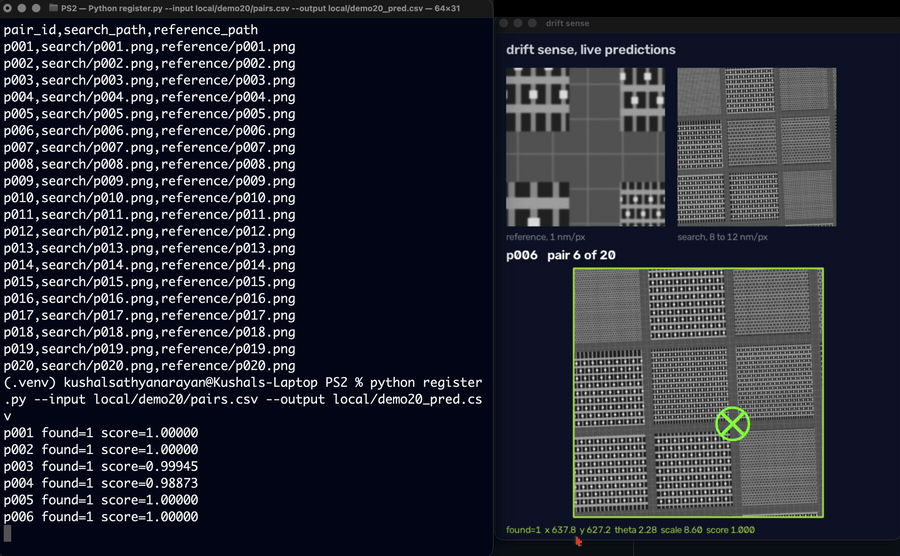](https://drive.google.com/file/d/1t1uv_nKDmpo3YISUgpnWzXUI2qzN_WHd/view?usp=sharing)

The preview above is twenty five seconds drawn from the three minute run: the localizer answering on one pair with its error against the recorded truth, then the success case, the honest failure and the runtime comparison. The full recording additionally covers the environment check, dataset generation, the confidence diagnostics, and the batch, manifest and accelerator invocation forms, and ends with the test suite. A copy is in the repository as [drift_sense_demo.mp4](drift_sense_demo.mp4); GitHub cannot play an mp4 inside a readme, so the link above is the one to use.

## Repository layout

```
register.py                Phase 2 entry point, pairs csv in, predictions csv out
generate_dataset.py        dataset generation entry point
localize.py                Phase 1 entry point, single pair and batch
configs/                   generator and matcher configurations
src/drift_sense/
    params.py              structure and imaging parameters with literature provenance
    geometry/              procedural DRAM and FinFET layout builders
    imaging/sem.py         secondary electron image formation
    imaging/optical.py     RGB brightfield image formation
    generator.py           pair generation and ground truth bookkeeping
    localize.py            matching pipeline
    presence.py            presence feature construction, shared by fitting and inference
    backend.py             cpu and accelerator compute backends
    reranker.py            optional learned decision, numpy inference
    api.py                 drop in matcher interface
    evaluate.py            metrics and plots
scripts/
    generate_phase2_suite.py   Phase 2 suites in the blind composition
    fit_presence.py            fits the presence model, reports cross validated F1
    tune_phase2.py             sweeps the decision and reports every scored component
    score_predictions.py       scores a predictions csv against a suite's ground truth
    package_submission.py      builds the zip and self tests it with sockets blocked
    ...                        Phase 1 generators, evaluation and training tools
models/                    presence model and exported re-ranker weights
notebooks/                 re-ranker training notebook
docs/                      method, citations, failure analyses, development log
references/                bibliography
results/                   headline result tables and figures
experiments/               one timestamped folder per run
```

### How the modules fit together

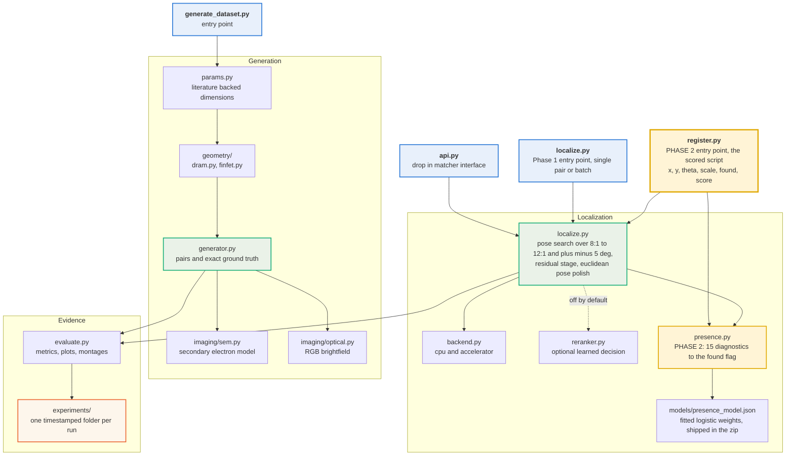

## Method

**Generator.** A specimen is built once per pair as a material map and a height map on a nanometre grid, using published pitches and dimensions for either a DRAM cell array (word lines, bit lines, storage node contacts, mats separated by sense amplifier and driver stripes) or FinFET logic (fin and gate grids, standard cell rows, diffusion breaks, contacts, vias, and one perfectly regular SRAM block). Secondary electron emission is modelled as material yield times the secant of the local surface tilt, so the bright feature edges characteristic of SEM emerge from surface physics rather than from an edge filter. Each capture then samples that one specimen through its own pose and applies beam blur with astigmatism, per line scan drift, jitter and vibration, dielectric charging, Poisson shot noise set by electron dose, Gaussian read noise, and an 8 bit tone map. The two captures draw from independent random generators and the search capture always receives a far lower dose. Ground truth is computed by mapping the reference centre through both capture transforms including the scan offsets, so the recorded truth cannot disagree with the rendered pixels.

**Localizer.** The reference is blurred to a bank of candidate search resolutions, each blur including the box filter equivalent of the magnification ratio so the template carries the same anti aliasing the search image does. The nominal pose is evaluated first at full resolution, because an exact decimation with no rotation is by far the most likely case; a wide grid over rotation and scale is screened at half resolution only when the nominal pose correlates weakly, and an off nominal pose must beat the nominal one by a margin before it is accepted, since a wide grid gives many chances for a wrong pose to win on noise. Impulse noise is removed by an adaptive median that fires only when outliers are detected, and contrast polarity is decided from the signed correlation extrema.

Among the resulting correlation peaks, a single dominant peak is returned directly with parabolic sub pixel refinement. When the surface is degenerate, a residual disambiguation stage runs: the shared periodic content is estimated by a pixelwise median over aligned candidate windows and projected out of the template together with its sub pixel shift terms, the remaining deviation field is scored densely in closed form at every position, and a robust z score decides whether one candidate is identifiably the true site through its defect signature. If none is, the site is genuinely ambiguous at the available noise level and the mandated tie break returns the equal match closest to the search image centre. Every answer therefore carries its regime: unique peak, identified by residual, or tie break convention.

## Results

Measured on 150 pairs from four generators that share no image formation code, so the localizer is tested under domain shift rather than against its own assumptions.

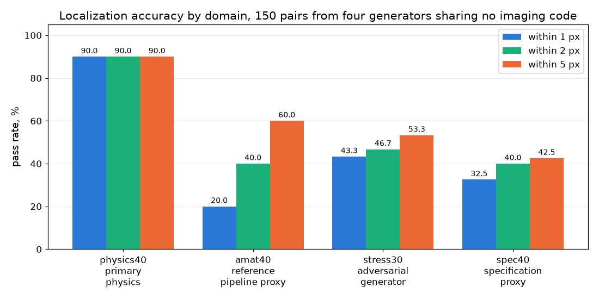

| Domain | What it tests | 1 px | 2 px | 5 px | median | runtime |
| --- | --- | --- | --- | --- | --- | --- |
| `physics40` | primary physics generator | 90.0% | 90.0% | 90.0% | 0.13 px | 2.03 s |
| `amat40` | faithful reference pipeline proxy | 20.0% | 40.0% | 60.0% | 2.85 px | 2.06 s |
| `stress30` | adversarial generator | 43.3% | 46.7% | 53.3% | 4.13 px | 2.35 s |
| `spec40` | organiser specification proxy | 32.5% | 40.0% | 42.5% | 18.83 px | 2.10 s |

The domains that score lowest are the ones deliberately built to be hardest. Accuracy is reported per domain because a single number would hide which generator produced the data.

### A success case, and an honest failure

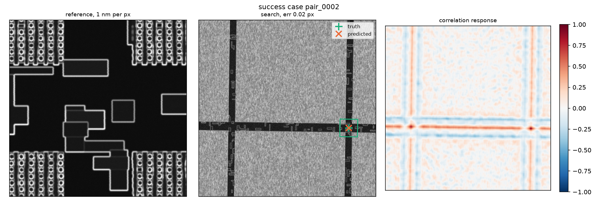

A FinFET site with a diffusion break inside the window. One correlation peak dominates, the prediction lands 0.02 px from truth, and the answer is labelled `unique_peak`.

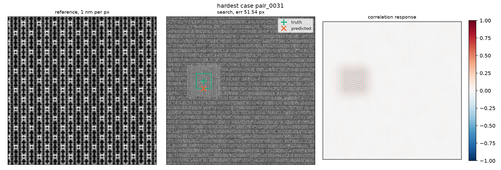

A window deep inside a defect free DRAM mat, where every cell is a near copy of its neighbours. The correlation response is a lattice of near equal peaks rather than one, and the prediction lands on a wrong periodic instance, 51.54 px away. Three independent tests show this is information limited rather than a search failure: raising the candidate budget from 6 to 24 changed no answer on any of the 150 pairs, the failing cases recover the correct scale and rotation, and supplying the true pose from the generator metadata does not resolve them. The localizer reports `tie_break_convention` here rather than claiming certainty.

### Confidence is calibrated, not asserted

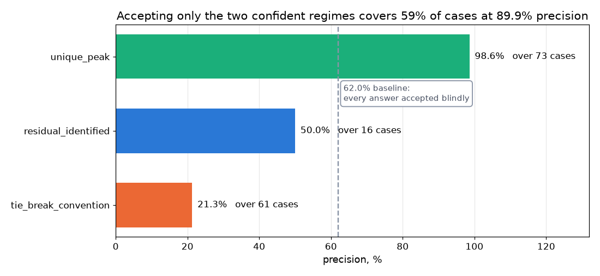

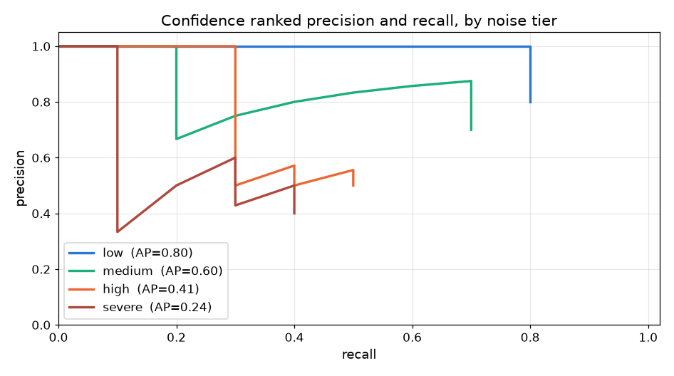

Accepting the two confident regimes and re acquiring on the third covers 59 percent of cases at 89.9 percent precision, against 62.0 percent if every answer is trusted blindly. On a real tool that difference is the difference between trusting a measurement and re acquiring at lower magnification.

### Robustness across the stated pose range

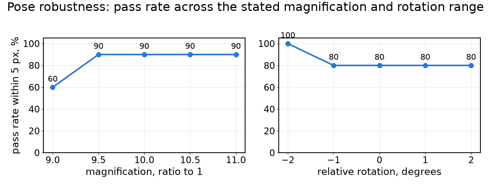

Pass rate holds across magnification 9:1 to 11:1 and rotation of plus or minus 2 degrees, so the result is not tuned to the exact nominal case. That sweep is the Phase 1 range; the Phase 2 entry point searches the wider disclosed 8:1 to 12:1 and plus or minus 5 degrees, and the held out figures under Phase 2 results above are measured over that full range.

### Runtime

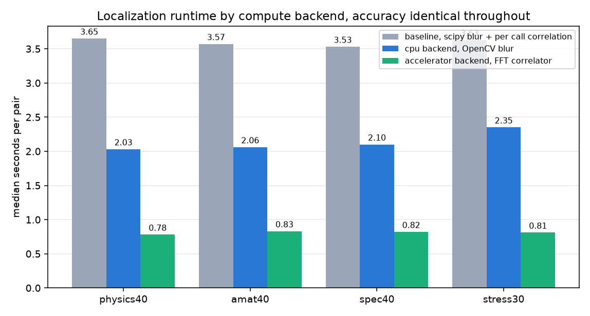

The blur bank and the correlation account for 97 percent of the runtime and are the only operations behind a compute backend. The default is numpy and OpenCV, so the submitted inference path needs no framework.

See [results/README.md](results/README.md) for the full tables and the ablation record, and `experiments/` for every run.

## Documentation

* [docs/architecture.md](docs/architecture.md) coordinate frames, generator and localizer pipelines, failure modes by construction
* [docs/failure_analysis.md](docs/failure_analysis.md) root cause of every known failure mode, the oracle experiment separating recoverable from ill posed cases, and the recorded negative results
* [docs/citations.md](docs/citations.md) every noise model, augmentation and structural parameter mapped to public literature
* [docs/dataset_format.md](docs/dataset_format.md) on disk format and metadata fields
* [docs/development_log.md](docs/development_log.md) chronological record of every major change and the measurement that motivated it
* [references/references.bib](references/references.bib) bibliography

## Assumptions and limitations

* For Phase 2 the magnification is assumed to lie in the disclosed 8 to 12 range and the relative rotation within plus or minus 5 degrees, which the addendum states are exact and intended to be hard coded. Outside those ranges the pose search will not find the correct hypothesis. The Phase 1 entry point retains its narrower 9 to 11 and plus or minus 6 degree grid.
* Credit on the degraded set falls sharply with severity, to about 0.20 at the hardest of four levels, where the failures are misses of hundreds of pixels rather than imprecision. Factor knockouts on paired suites from identical seeds attribute that collapse: electron dose is 43.8 percent of the loss and beam spot blur 21.2, so **65 percent of the whole loss is shot noise and optical low pass, information never collected rather than corrupted**, and 74 percent of the part any single factor explains, while scan jitter at 13.7 percent and polygon scaling at 8.8 are the structured quarter that inverts in principle; drift and charging measure nothing. Inverting jitter perfectly would be worth about half a localization point, which is why no de jitter pass was built. It remains the largest single gap in the method and most of it is a physical boundary, not an algorithmic one (`experiments/20260830_degrade_attribution`).
* Radial distortion is not part of the pose model. Over a 100 pixel footprint local radial distortion is close to affine and is largely absorbed by the scale search, but strong distortion is not corrected.
* Row jitter is modelled as an appearance change rather than inverted, so per row displacements much larger than a pixel degrade correlation.
* Residual errors are dominated by information limited spatial ambiguity rather than search range or candidate budget failure. In the tested image formation regime, competing periodic sites become indistinguishable within the available image evidence: raising the candidate budget from 6 to 24 changed no answers on 150 pairs, the failing cases recover the correct scale and rotation while selecting a wrong periodic instance, and supplying the true pose from metadata did not resolve them. The localizer reports this regime rather than hiding it, and the mandated tie break decides the answer.
* No proprietary fab data is used anywhere. All structure parameters come from public literature, listed in the citations document.
