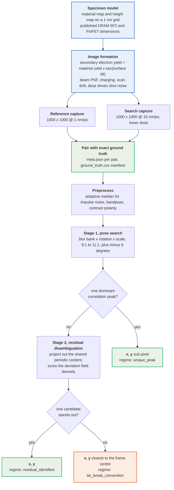
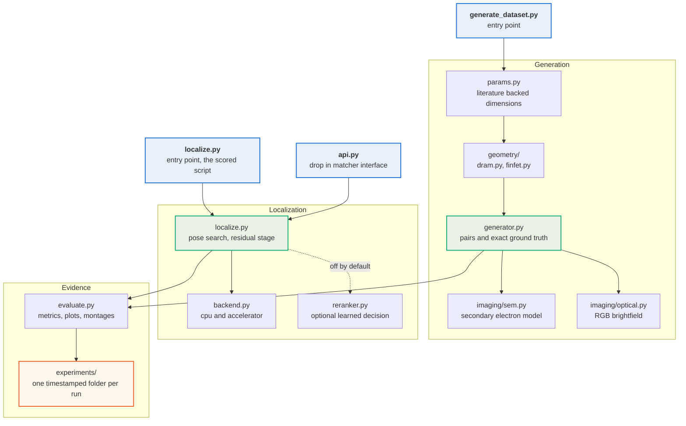

# Drift Sense

Navigation error recovery for wafer inspection tools. Given a high magnification reference image of a die site and a wider, noisier search image of the surrounding region, find where the reference pattern sits inside the search image and return its centre coordinates.

The repository contains two deliverables plus the evidence behind them: a synthetic dataset generator grounded in published semiconductor structure and SEM imaging physics, and a localization algorithm with a documented failure analysis.


Both images are generated by this repository, and the true centre is recorded with them. The reference occupies roughly 100 x 100 px of the search frame, and the surrounding layout repeats, so hundreds of sites look alike. That ambiguity, rather than noise, is what makes the task hard.

## Problem and conventions

| Item | Value |
| --- | --- |
| Reference image | 1000 x 1000 grayscale, 1 nm per pixel, 1 um field of view |
| Search image | 1000 x 1000 grayscale, nominally 10 nm per pixel, 10 um field of view |
| Scale relationship | nominally 10 to 1, handled explicitly over 9 to 1 through 11 to 1 |
| Rotation | handled to plus or minus 6 degrees, refined to 0.09 degrees |
| Runtime | 2.03 s per pair on one CPU core, 0.52 s on an accelerator, identical answers |
| Output | centre coordinates x y in search image pixels, sub pixel |
| Coordinate origin | centre of the top left pixel, x increases right, y increases down |
| Multiple matches | the match closest to the search image centre is returned |

The reference pattern occupies roughly 100 x 100 pixels inside the search image. The two images are independent physical captures, so their noise is independent and the search image is the noisier of the two.

### End to end pipeline



Every answer carries the regime that produced it, so a caller can tell a measurement it can act on from one it should re acquire.

## Setup

```
git clone https://github.com/kushal-script/drift-sense.git
cd drift-sense
python3 -m venv .venv
.venv/bin/pip install -r requirements.txt
```

The three commands below take a clean clone to a localized pair with nothing else installed:

```
.venv/bin/python generate_dataset.py --generator physics --style mixed --num 2 --out data/demo --seed 1
.venv/bin/python localize.py data/demo/pair_0000/reference.png data/demo/pair_0000/search.png
```

The second command prints one line, `x y`, the predicted centre of the reference pattern inside the search image. `data/demo/pair_0000/meta.json` holds the true centre for comparison.

Python 3.11 or newer. Inference needs only numpy, scipy, OpenCV, Pillow and matplotlib; no deep learning framework is required. All commands below run from the repository root.

Two further dependency files exist for optional work: `requirements_dev.txt` adds pytest for the test suite, and `requirements_train.txt` adds torch, needed only to retrain the optional re-ranker since inference reads its exported weights with numpy.

```
.venv/bin/pip install -r requirements_dev.txt
.venv/bin/python -m pytest tests/ -q
```

The test suite asserts the coordinate convention, that the axes are not transposed, sub pixel accuracy on noise free pairs whose answer is unique by construction, generator reproducibility from a seed, independent noise between the two captures, the mandated noisier search capture, that the confidence score ranks an identifiable pattern above a degenerate one, and that every pair layout an evaluator might supply is discovered, including a flat directory named with the full word reference and a directory holding a single pair.

## Generate a dataset

```
.venv/bin/python generate_dataset.py --generator physics --style mixed --num 40 --out data/train40 --seed 1 --previews
```

Three generators are available, sharing no image formation code, so the localizer can be measured under domain shift instead of only against its own assumptions:

| `--generator` | What it produces |
| --- | --- |
| `physics` | primary generator, specimen material and height maps imaged twice through a secondary electron model; supports `--modality sem` and `--modality optical` |
| `spec` | independent reimplementation of the published organiser specification, coarse structure presets, 9 to 1 through 11 to 1 magnification, the full published degradation list |
| `amat_proxy` | faithful reproduction of the reference starter pipeline, 10 um fine canvas at 1 nm per pixel decimated by area averaging, four noise tiers and five acquisition variants |
| `stress` | adversarial generator with painted edges, plain Gaussian noise and area averaged downsampling |

Other flags: `--style` is `dram`, `finfet` or `mixed`; `--num` the pair count; `--seed` the master seed; `--previews` also writes search images with the truth region drawn on.

Each pair folder holds `reference.png`, `search.png` and `meta.json` recording the seed, every structure parameter, every transformation and noise setting, and the exact ground truth centre. `ground_truth.csv` is the dataset manifest with reference path, search path and truth coordinates per pair.

## Localize

Single pair, prints one line `x y`:

```
.venv/bin/python localize.py path/to/reference.png path/to/search.png
```

Full diagnostics including the confidence regime, matched pose and runtime:

```
.venv/bin/python localize.py path/to/reference.png path/to/search.png --json
```

`--batch` accepts either a directory of pair subfolders, a directory holding a single `reference.png` and `search.png`, or, with `--pattern flat`, one directory of images paired by the token left after the role word, so `pair_0000_reference.png` pairs with `pair_0000_search.png`.

Batch over a directory of pair folders, writing predictions and a runtime record:

```
.venv/bin/python localize.py --batch path/to/dataset --out results/predictions.csv
```

Batch over an explicit manifest with `reference_path` and `search_path` columns:

```
.venv/bin/python localize.py --manifest pairs.csv --out results/predictions.csv
```

Run on an accelerator instead of the CPU. The default is CPU and an accelerator is never selected implicitly, so a missing or mismatched CUDA install can never change what the default path does:

```
.venv/bin/python localize.py path/to/reference.png path/to/search.png --device auto
```

`--device` accepts `cpu`, `cuda`, `mps` or `auto`; a device that is not present is an error rather than a silent downgrade. The accelerator backend needs torch, which is already in `requirements_train.txt`; the CPU path does not.

Two further flags exist and are off by default. `--preset` forces the imaging preset, which otherwise follows the input: colour input selects the optical preset and grayscale the SEM one, and `--preset sem` or `--preset optical` overrides that choice. `--reranker` enables the optional learned re-ranker described under model weights below; it may override which candidate the residual stage selects, and when it abstains the classical decision still stands.

Batch over a flat directory whose files pair by shared prefix:

```
.venv/bin/python localize.py --batch path/to/images --pattern flat --out results/predictions.csv
```

No source changes are needed for any of these forms. The predictions CSV carries pair id, both input paths, predicted x and y, peak score, confidence regime, candidate count, matched rotation and scale, and per pair runtime; a companion `.runtime.json` records hardware, Python version and the timing method.

RGB input is detected automatically and routed through an optical preset.

To use the localizer inside another harness, the drop in interface returns position and a calibrated confidence:

```python
from drift_sense.api import zncc_match
result = zncc_match(reference_img, search_img)
result["x"], result["y"], result["score"]
```

## Evaluate

Accuracy, timing, plots and success and failure montages against a generated dataset:

```
.venv/bin/python scripts/evaluate.py --dataset data/train40 --name baseline
```

Pass rates per noise tier with confidence ranked precision recall curves:

```
.venv/bin/python scripts/evaluate_tiers.py --dataset data/amat_tiers --name tier_report
```

Assert that every compute backend returns the same answer as the reference path, which is scipy for the blur and OpenCV for the correlation:

```
.venv/bin/python scripts/verify_backends.py
```

Configuration ablation across every dataset at once:

```
.venv/bin/python scripts/compare_configs.py --datasets data/train40 data/stress30 --name ablation
```

Every run writes into a timestamped folder under `experiments/`, holding the configuration, a per pair results table, aggregate metrics and plots, so any number quoted anywhere in this repository is traceable to the run that produced it.

## Submission requirement mapping

| # | Requirement | Where it is | Notes |
| --- | --- | --- | --- |
| 1 | README with complete setup | this file | clone, install, generate a pair and localize using only the commands above; verified from a fresh virtual environment |
| 2 | Dataset generator script | [generate_dataset.py](generate_dataset.py) | accepts `--style dram/finfet/mixed`, `--num`, `--out`; records the true centre of every pair in `meta.json` and in the `ground_truth.csv` manifest |
| 3 | Localization inference script | [localize.py](localize.py) | takes a reference path and a search path, prints `x y`; runs with no manual edits, and also accepts `--batch` or `--manifest` for an evaluator supplied set |
| 4 | Model weights | [models/reranker.npz](models/reranker.npz), [models/reranker.pt](models/reranker.pt) | the submitted inference path is **not** deep learning; the optional re-ranker is off by default and is loaded automatically from `models/` when `--reranker` is passed, with no path editing. Inference reads the numpy `.npz`, so no framework is required; the training script writes the `.pt` as the same weights in PyTorch format |
| 5 | Training script or notebook | [notebooks/train_reranker.ipynb](notebooks/train_reranker.ipynb), [scripts/train_reranker.py](scripts/train_reranker.py) | reproduces the whole chain: generate, harvest candidates, train, calibrate, export, and verify that the numpy and torch forward passes agree |
| 6 | requirements.txt | [requirements.txt](requirements.txt), [requirements_freeze.txt](requirements_freeze.txt) | `requirements.txt` is the pinned runtime set the inference and generation scripts need, and is the file to install: a clean clone plus this file was verified end to end from a fresh virtual environment. `requirements_freeze.txt` is the complete `pip freeze` of the development environment, including the test and training only packages |
| 7 | Citation document | [docs/citations.md](docs/citations.md), [references/references.bib](references/references.bib) | 27 references, each verified against the publisher and each tied to the specific parameter or noise model it supports; these are the sources cited in the presentation |


```
```


## Repository layout

```
generate_dataset.py        dataset generation entry point
localize.py                localization entry point, single pair and batch
configs/                   generator and matcher configurations
src/drift_sense/
    params.py              structure and imaging parameters with literature provenance
    geometry/              procedural DRAM and FinFET layout builders
    imaging/sem.py         secondary electron image formation
    imaging/optical.py     RGB brightfield image formation
    generator.py           pair generation and ground truth bookkeeping
    localize.py            matching pipeline
    backend.py             cpu and accelerator compute backends
    reranker.py            optional learned decision, numpy inference
    api.py                 drop in matcher interface
    evaluate.py            metrics and plots
scripts/                   auxiliary generators, evaluation and training tools
models/                    exported re-ranker weights
notebooks/                 re-ranker training notebook
docs/                      method, citations, dataset format, development log
references/                bibliography
results/                   headline result tables and figures
experiments/               one timestamped folder per run
```

### How the modules fit together



## Method

**Generator.** A specimen is built once per pair as a material map and a height map on a nanometre grid, using published pitches and dimensions for either a DRAM cell array (word lines, bit lines, storage node contacts, mats separated by sense amplifier and driver stripes) or FinFET logic (fin and gate grids, standard cell rows, diffusion breaks, contacts, vias, and one perfectly regular SRAM block). Secondary electron emission is modelled as material yield times the secant of the local surface tilt, so the bright feature edges characteristic of SEM emerge from surface physics rather than from an edge filter. Each capture then samples that one specimen through its own pose and applies beam blur with astigmatism, per line scan drift, jitter and vibration, dielectric charging, Poisson shot noise set by electron dose, Gaussian read noise, and an 8 bit tone map. The two captures draw from independent random generators and the search capture always receives a far lower dose. Ground truth is computed by mapping the reference centre through both capture transforms including the scan offsets, so the recorded truth cannot disagree with the rendered pixels.

**Localizer.** The reference is blurred to a bank of candidate search resolutions, each blur including the box filter equivalent of the magnification ratio so the template carries the same anti aliasing the search image does. The nominal pose is evaluated first at full resolution, because an exact decimation with no rotation is by far the most likely case; a wide grid over rotation and scale is screened at half resolution only when the nominal pose correlates weakly, and an off nominal pose must beat the nominal one by a margin before it is accepted, since a wide grid gives many chances for a wrong pose to win on noise. Impulse noise is removed by an adaptive median that fires only when outliers are detected, and contrast polarity is decided from the signed correlation extrema.

Among the resulting correlation peaks, a single dominant peak is returned directly with parabolic sub pixel refinement. When the surface is degenerate, a residual disambiguation stage runs: the shared periodic content is estimated by a pixelwise median over aligned candidate windows and projected out of the template together with its sub pixel shift terms, the remaining deviation field is scored densely in closed form at every position, and a robust z score decides whether one candidate is identifiably the true site through its defect signature. If none is, the site is genuinely ambiguous at the available noise level and the mandated tie break returns the equal match closest to the search image centre. Every answer therefore carries its regime: unique peak, identified by residual, or tie break convention.

## Results

Measured on 150 pairs from four generators that share no image formation code, so the localizer is tested under domain shift rather than against its own assumptions.


| Domain | What it tests | 1 px | 2 px | 5 px | median | runtime |
| --- | --- | --- | --- | --- | --- | --- |
| `physics40` | primary physics generator | 90.0% | 90.0% | 90.0% | 0.13 px | 2.03 s |
| `amat40` | faithful reference pipeline proxy | 20.0% | 40.0% | 60.0% | 2.85 px | 2.06 s |
| `stress30` | adversarial generator | 43.3% | 46.7% | 53.3% | 4.13 px | 2.35 s |
| `spec40` | organiser specification proxy | 32.5% | 40.0% | 42.5% | 18.83 px | 2.10 s |

The domains that score lowest are the ones deliberately built to be hardest. Accuracy is reported per domain because a single number would hide which generator produced the data.

### A success case, and an honest failure


A FinFET site with a diffusion break inside the window. One correlation peak dominates, the prediction lands 0.02 px from truth, and the answer is labelled `unique_peak`.


A window deep inside a defect free DRAM mat, where every cell is a near copy of its neighbours. The correlation response is a lattice of near equal peaks rather than one, and the prediction lands on a wrong periodic instance, 51.54 px away. Three independent tests show this is information limited rather than a search failure: raising the candidate budget from 6 to 24 changed no answer on any of the 150 pairs, the failing cases recover the correct scale and rotation, and supplying the true pose from the generator metadata does not resolve them. The localizer reports `tie_break_convention` here rather than claiming certainty.

### Confidence is calibrated, not asserted


Accepting the two confident regimes and re acquiring on the third covers 59 percent of cases at 89.9 percent precision, against 62.0 percent if every answer is trusted blindly. On a real tool that difference is the difference between trusting a measurement and re acquiring at lower magnification.

### Robustness across the stated pose range


Pass rate holds across magnification 9:1 to 11:1 and rotation of plus or minus 2 degrees, so the result is not tuned to the exact nominal case.

### Runtime


The blur bank and the correlation account for 97 percent of the runtime and are the only operations behind a compute backend. The default is numpy and OpenCV, so the submitted inference path needs no framework.

See [results/README.md](results/README.md) for the full tables and the ablation record, and `experiments/` for every run.

## Documentation

* [docs/architecture.md](docs/architecture.md) coordinate frames, generator and localizer pipelines, failure modes by construction
* [docs/failure_analysis.md](docs/failure_analysis.md) root cause of every known failure mode, the oracle experiment separating recoverable from ill posed cases, and the recorded negative results
* [docs/citations.md](docs/citations.md) every noise model, augmentation and structural parameter mapped to public literature
* [docs/dataset_format.md](docs/dataset_format.md) on disk format and metadata fields
* [docs/development_log.md](docs/development_log.md) chronological record of every major change and the measurement that motivated it
* [references/references.bib](references/references.bib) bibliography

## Assumptions and limitations

* The magnification is assumed to lie between 9 to 1 and 11 to 1 and the relative rotation within plus or minus 6 degrees. Outside those ranges the pose search will not find the correct hypothesis.
* Radial distortion is not part of the pose model. Over a 100 pixel footprint local radial distortion is close to affine and is largely absorbed by the scale search, but strong distortion is not corrected.
* Row jitter is modelled as an appearance change rather than inverted, so per row displacements much larger than a pixel degrade correlation.
* Residual errors are dominated by information limited spatial ambiguity rather than search range or candidate budget failure. In the tested image formation regime, competing periodic sites become indistinguishable within the available image evidence: raising the candidate budget from 6 to 24 changed no answers on 150 pairs, the failing cases recover the correct scale and rotation while selecting a wrong periodic instance, and supplying the true pose from metadata did not resolve them. The localizer reports this regime rather than hiding it, and the mandated tie break decides the answer.
* No proprietary fab data is used anywhere. All structure parameters come from public literature, listed in the citations document.
